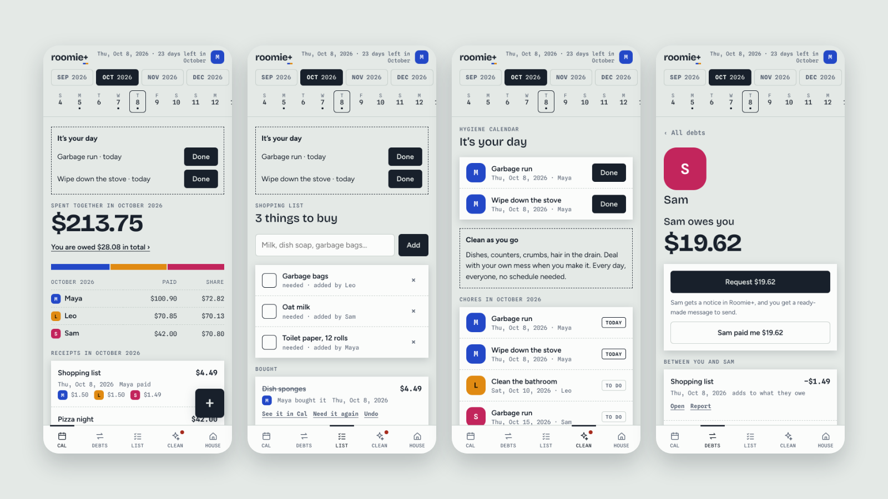
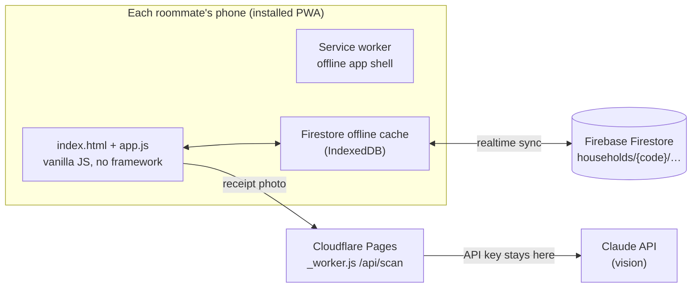
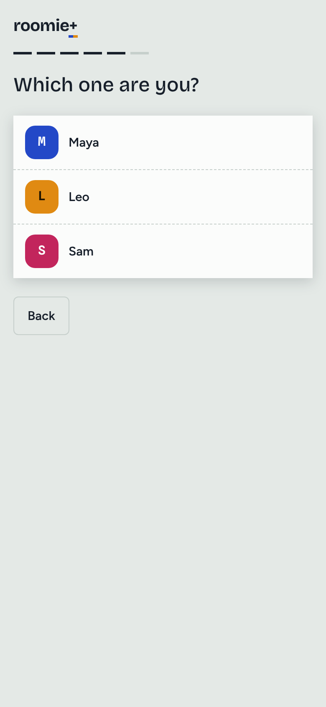
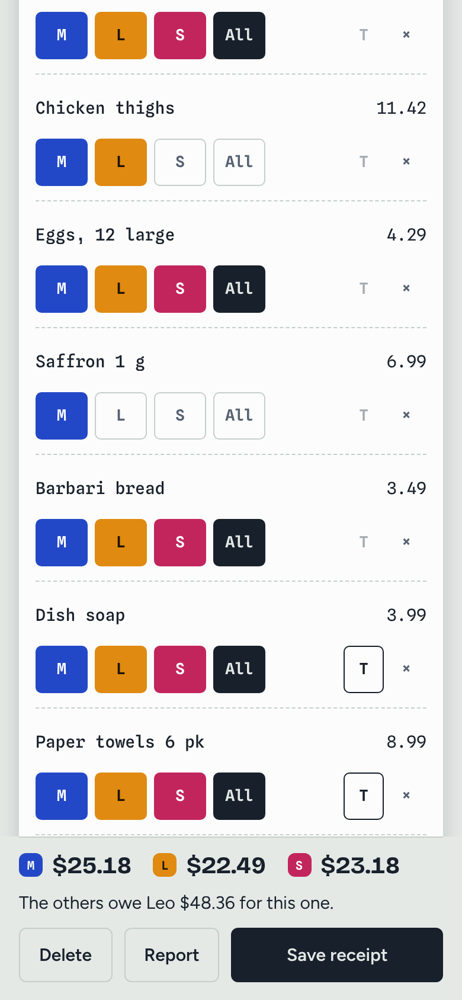
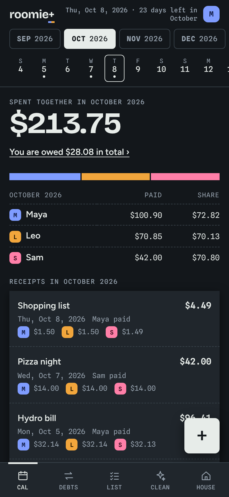

# Roomie+

**Money, shopping and chores for the people you live with.**

Splitwise is built for friend groups and trips. Roomie+ is built for people who share a fridge, a bathroom and a lease. Photograph a receipt, tap who each line is for, and it keeps a running tally of who owes whom. A shared shopping list feeds straight into the tally, and a fair cleaning rota makes sure nobody takes out the garbage twice in a row.

It is an installable web app (PWA): add it to your home screen and it opens full screen with its own icon, works offline, and syncs between roommates.

**[Try the live demo on your phone →](https://drezvani2003.github.io/roomieplus/)**



## What it does

**Cal: money for the month**
- Scan a receipt with your camera. Claude reads every line, price and tax flag; you fix anything it got wrong.
- Tag each line with one roommate, several, or **All**. Shared lines are split evenly.
- See what each person paid and owes for the month, with a calendar strip that always shows every month of your lease and every day of the month.

**Debts: settle up**
- Tap a roommate to see exactly what you owe them or they owe you, and every receipt and payment behind it.
- Their preferred payout (e-mail or phone, for Interac e-Transfer) is one tap to copy, and "Open my bank" jumps to your bank.
- **Request** posts a notice in their app and gives you a ready-made text or e-mail.
- **Fun round**: settle to the cent, the nearest $1 or $5, or let a coin flip decide. Everyone sees the same flip.
- **Report** a receipt or payment that looks wrong. It is flagged for the whole house and left out of the balances until resolved.

**List: shared shopping**
- Anyone adds what the house needs. Whoever is at the store ticks it off with who bought it, the price and who it is for, and it lands in Cal as part of that day's "Shopping list" receipt.

**Clean: a fair hygiene calendar**
- Garbage run, bathroom and mopping out of the box; add your own chores, frequency and weekday.
- **Build a fair schedule** deals out every turn until the end of the lease. Change any turn by hand and the rebuild balances everyone else around it.
- Each turn is To do, Today, Done or Missed, and a "Fair and square" table counts turns per person.
- On your chore day a notice with a Done button sits at the top of every screen.

**House**
- Address, lease dates, currency, roommates with photos, invite links, and a list of anything reported.

## How the numbers work

All money is kept in whole cents, so totals always add up exactly.

- **Tax** is spread only over the lines that were taxed (the receipt's H / T / VAT flags), in proportion to their price, using largest-remainder rounding. Tax lands on whoever those items belong to.
- **Shared lines** are divided evenly between the people tagged; leftover cents go to the payer first, so nobody is ever charged a cent the payer didn't spend.
- **Debts** are kept pairwise ("what Maya owes Leo"), not simplified across the house, so every amount can be traced back to specific receipts.
- **Fun round** is applied only to what is sent. A coin flip is a hash of the debtor, creditor and amount, so it comes out the same on every phone.

## How the chore schedule stays fair

The generator walks every upcoming chore date in order and gives each one to whoever has done **that chore** the fewest times, then whoever has the least on **that week**, then the fewest turns **overall**, then whoever went **longest ago**. Turns already done or set by hand are kept and counted, so a rebuild never undoes a swap. For two roommates over a year that comes out at 59 turns each.

## Architecture



- **Front end:** one plain JavaScript file and one stylesheet. No framework, no build step for the app itself.
- **Sync:** Firebase Firestore with anonymous sign-in. Each household lives under a long random code that doubles as the invite link.
- **Receipt reading:** a small Cloudflare Pages worker sends photos to the Claude API, so the API key never reaches a phone.
- **Offline:** a service worker caches the app; Firestore queues changes and syncs when the phone is back online.
- **Without any backend** the app still runs, storing everything on one phone. That is how the [live demo](https://drezvani2003.github.io/roomieplus/) works.

## Run it

```bash
npx serve .               # or any static file server
```

Open it on your phone or in a narrow browser window. With no settings it runs in on-phone mode.

To run it for real with sync and receipt scanning, follow **[DEPLOY.md](DEPLOY.md)**. It takes about 20 minutes and uses the free tiers of Cloudflare Pages and Firebase, plus a pay-per-use Claude API key for scanning.

Developer commands: `npm install`, `npm run build` (rebuilds `sync.js` from `firebase-adapter.js`), `npm test` (scan-server checks).

## More screens

| Setup | Splitting a receipt | Dark mode |
|---|---|---|
|  |  |  |

## Status and next steps

This is a working prototype. Next up:

- Push notifications for chore days and month-end (today reminders show when the app is opened).
- Real accounts instead of household codes.
- Native wrappers for the App Store and Google Play.
